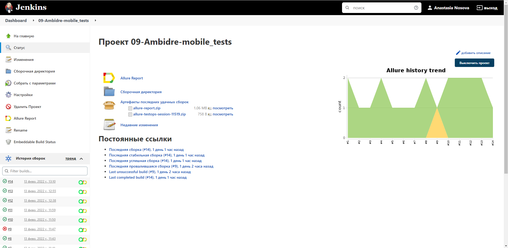
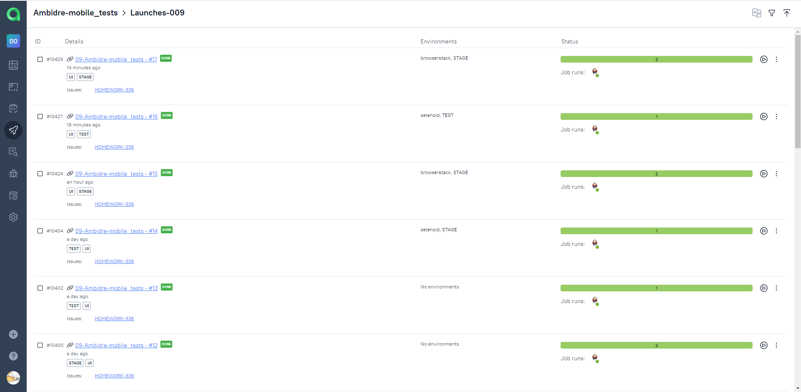
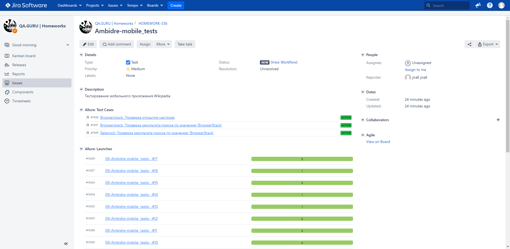

# Проект по автоматизации тестирования UI для мобильного приложения [Wikipedia](https://github.com/wikimedia/apps-android-wikipedia/releases/download/latest/app-alpha-universal-release.apk)

## Покрытый функционал
> Разработаны автотесты на <code>UI</code>.
- :white_check_mark: Отображение результатов поиска
- :white_check_mark: Проверка открытия настроек
- :white_check_mark: Проверка первых четырех экранов Getting Started
## Технологический стек

<p align="center">


</p>

> В данном проекте автотесты написаны на <code>Java</code> с использованием фреймворков <code>Selenide</code> и <code>Appium</code> для UI-тестов, и библиотеки <code>REST Assured</code> для отображения видео в отчете.
>
> <code>BrowserStack</code> выполняет запуск приложения на удаленном мобильном Android-устройстве.
>
> <code>Selenoid</code> выполняет запуск приложения на удаленном сервере в контейнерах <code>Docker</code>.
>
> <code>JUnit 5</code> используется для модульного тестирования
>
> <code>Gradle</code> используется для автоматизированной сборки проекта
>
> <code>Jenkins</code> выполняет запуск тестов
>
> <code>Allure Report</code> формирует отчет о запуске тестов
>
> Автотесты интегрируются с тест-менеджмент системой <code>Allure TestOps</code> и таск-трекер системой <code>Jira</code>
>
> В <code>Telegram</code> отправляются уведомления о пройденном прогоне с помощью библиотеки [allure-notifications](https://github.com/qa-guru/allure-notifications)

## Запуск тестов из терминала
### Локальный запуск тестов

```
gradle clean test
```

##  Для запусков автотестов используется [Jenkins](https://jenkins.autotests.cloud/job/09-Ambidre-mobile_tests/)



##  Анализ результатов запусков в Jenkins через Allure Reports

### Главная страница Allure-отчета


### Информация о тестовом прогоне в графическом виде


### Группировка тестов по проверяемому функционалу


##  Интеграция тестов c тест-менеджмент системой [Allure TestOps](https://allure.autotests.cloud/jobrun/9938)

### Основной дашборд


### Дашборд для отображения успешности и длительности тестов


### Дашборд по стендам


### Дашборд по членам команды


### Запуски тестов



### Результаты запуска тестов


### Сгруппированные тест-кейсы по проверяемому функционалу


##  Интеграция тестов c таск-трекер системой [Jira](https://jira.autotests.cloud/browse/HOMEWORK-336)

> Интеграция с <code>Jira</code> позволяет добавлять в задачи тест-кейсы, запуски и их результаты.



##  Уведомления в Telegram с использованием бота

> Реализована отправка уведомлений о прогоне с помощью бота в <code>Telegram</code>.


##  Пример запуска теста в [BrowserStack](https://www.browserstack.com/)


##  Пример запуска теста в Selenoid


